# DotNetStarterKitv2 — User Guide

> A production-grade full-stack starter kit combining **.NET Core 9** (Clean Architecture + CQRS) with **React 19** (feature-sliced architecture) and **SQL Server**. Use this as a template to bootstrap new projects without re-implementing foundational concerns.

---

## Table of Contents

1. [Overview](#1-overview)
2. [Prerequisites & Quick Start](#2-prerequisites--quick-start)
3. [Platform Architecture](#3-platform-architecture)
   - [System Architecture Overview](#system-architecture-overview) _(diagram)_
   - [Clean Architecture Layers](#clean-architecture-layer-diagram) _(diagram)_
   - [Request / Response Flow](#request--response-flow) _(diagram)_
4. [Platform Modules](#4-platform-modules)
   - 4.1 [Domain Module](#41-domain-module) _(Entity Relationship Diagram)_
   - 4.2 [Application Module](#42-application-module) _(CQRS Flow Diagram)_
   - 4.3 [Infrastructure Module](#43-infrastructure-module)
   - 4.4 [API Module](#44-api-module) _(Middleware Pipeline Diagram)_
   - 4.5 [Web (Frontend) Module](#45-web-frontend-module) _(State Management Diagram)_
   - 4.6 [Tests Module](#46-tests-module)
5. [Features](#5-features)
6. [Design Patterns](#6-design-patterns)
7. [API Reference](#7-api-reference)
8. [Database & Migrations](#8-database--migrations)
9. [Authentication & Authorization](#9-authentication--authorization)
10. [Configuration & Secrets](#10-configuration--secrets)
11. [Testing Guide](#11-testing-guide)
12. [CI/CD Pipeline](#12-cicd-pipeline)
13. [Development Workflow](#13-development-workflow)
14. [Extending the Kit](#14-extending-the-kit)

---

## 1. Overview

DotNetStarterKitv2 eliminates the setup tax that every new project pays. Instead of spending the first two weeks wiring up logging, authentication, error handling, pagination, and CI/CD, your team starts with all of that already in place and battle-tested.

### What You Get Out of the Box

| Concern | Solution |
|---------|----------|
| API Framework | ASP.NET Core 9 Minimal APIs |
| Architecture | Clean Architecture (4 layers) |
| Command/Query Separation | CQRS with MediatR 12 |
| Database ORM | EF Core 9, SQL Server |
| Validation | FluentValidation (pipeline-integrated) |
| Object Mapping | AutoMapper |
| Logging | Serilog (structured, correlation IDs, sensitive data masking) |
| Authentication | JWT (HttpOnly cookies) + Azure AD / Entra ID SSO |
| Authorization | Permission-based policies |
| Error Handling | Global middleware → RFC 9457 ProblemDetails |
| Audit Trail | Automatic capture of all entity changes with JSON snapshots |
| Soft Delete | Global EF Core query filter |
| Pagination | Built-in `PagedRequest` / `PagedResponse<T>` |
| Result Pattern | `Result<T>` discriminated union (no exceptions for expected errors) |
| Caching | In-memory cache with prefix-based invalidation |
| Email | Pluggable (SMTP or logging stub for dev) |
| File Storage | Pluggable (local disk; swap for Azure Blob) |
| Security Headers | HSTS, CSP, X-Frame-Options, Referrer-Policy |
| Frontend Framework | React 19 + TypeScript |
| Server State | TanStack Query v5 |
| Client State | Redux Toolkit |
| Forms | React Hook Form + Zod |
| UI Styling | Tailwind CSS (dark theme) |
| Testing | xUnit + NSubstitute + FluentAssertions (118 tests) |
| CI/CD | GitHub Actions (build, test, lint, quality gate) |

### Technology Stack at a Glance

```
┌─────────────────────────────────────────────────────────┐
│  React 19 + TypeScript  │  Vite 5  │  Tailwind CSS      │  Frontend
├─────────────────────────────────────────────────────────┤
│  ASP.NET Core 9 Minimal APIs  │  Serilog  │  Swagger     │  API
├─────────────────────────────────────────────────────────┤
│  MediatR 12  │  FluentValidation  │  AutoMapper          │  Application
├─────────────────────────────────────────────────────────┤
│  EF Core 9  │  SQL Server  │  BCrypt  │  MSAL            │  Infrastructure
└─────────────────────────────────────────────────────────┘
```

### System Architecture Overview

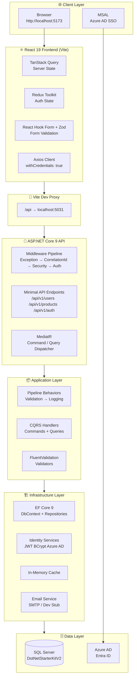

---

## 2. Prerequisites & Quick Start

### Prerequisites

| Tool | Minimum Version | Purpose |
|------|----------------|---------|
| .NET SDK | 9.0 | Backend runtime |
| Node.js | 18 LTS | Frontend tooling |
| SQL Server Express | 2019+ | Local database |
| Visual Studio | 2022 17.x | .NET IDE |
| VS Code | Latest | Frontend / full-repo IDE |
| Git | 2.x | Version control |

### 5-Minute Setup

**Step 1 — Clone and open**
```bash
git clone <repo-url> MyNewProject
cd MyNewProject
```
Open `DotNetStarterKitv2.sln` in Visual Studio.
Open the repo root folder in VS Code.

**Step 2 — Configure database connection**

The connection string is stored in User Secrets (never in committed files):
```bash
dotnet user-secrets set "ConnectionStrings:DefaultConnection" \
  "Server=YOUR_SERVER\SQLEXPRESS;Database=DotNetStarterKitV2;Integrated Security=True;TrustServerCertificate=True" \
  --project src/Api
```

**Step 3 — Run database migrations**
```bash
dotnet ef database update --project src/Infrastructure --startup-project src/Api
```

**Step 4 — Start the API**

In Visual Studio: select the `https` launch profile → press **F5**.
API starts at `https://localhost:7116` — Swagger opens automatically.

**Step 5 — Start the frontend**
```bash
cd src/Web
npm install
npm run dev
```
Frontend starts at `http://localhost:5173`.

**Step 6 — Verify everything works**
```bash
dotnet test                          # 118 tests should pass
cd src/Web && npm run test -- --run  # Frontend tests
```

---

## 3. Platform Architecture

### Folder Structure

```
DotNetStarterKitv2/
│
├── src/
│   ├── Domain/          ← Core business logic (zero external dependencies)
│   ├── Application/     ← CQRS handlers, validators, interfaces
│   ├── Infrastructure/  ← EF Core, identity, services, DI wiring
│   ├── Api/             ← Minimal API endpoints, middleware, startup
│   └── Web/             ← React 19 frontend (Vite + TypeScript)
│
├── tests/
│   ├── Unit/            ← Isolated handler/validator tests (NSubstitute)
│   └── Integration/     ← Full HTTP round-trip tests (SQLite in-memory)
│
├── docs/                ← Documentation (this file)
├── scripts/             ← Dev utility scripts
└── .github/workflows/   ← GitHub Actions CI/CD
```

### Dependency Rule (Clean Architecture)

Dependencies flow **inward only**:

```
   ┌──────────┐
   │  Domain  │  ← No external dependencies
   └────┬─────┘
        │
   ┌────▼──────────┐
   │  Application  │  ← Depends on Domain only
   └────┬──────────┘
        │
   ┌────▼──────────────┐
   │  Infrastructure   │  ← Implements Application interfaces
   └────┬──────────────┘
        │
   ┌────▼───┐
   │  Api   │  ← Orchestrates all layers
   └────────┘
        │
   ┌────▼───┐
   │  Web   │  ← Calls Api over HTTP
   └────────┘
```

This is enforced at **compile time** via project references — Application cannot reference Infrastructure, Domain cannot reference anything.

### Clean Architecture Layer Diagram

```mermaid
graph TD
    subgraph Domain["🟣 Domain (Core)  —  Zero Dependencies"]
        Entities["Entities\nUser · Role · Product · Project\nPermission · AuditLog"]
        Enums["Enums\nUserStatus · AuditAction"]
        Exceptions["Domain Exceptions\nNotFound · Conflict · Forbidden"]
        BaseEntity["BaseEntity\nId · CreatedAt · IsDeleted\nDelete() · Restore()"]
    end

    subgraph Application["🔵 Application  —  Use Cases"]
        Interfaces["Interfaces\nIApplicationDbContext\nICurrentUserService · ITokenService\nIPasswordHasher · ICacheService"]
        CQRS["CQRS Handlers\nCreateUser · GetUsers\nCreateProduct · DeleteProduct\nLogin · AzureLogin"]
        Behaviors["Pipeline Behaviors\nValidationBehavior\nLoggingBehavior"]
        Results["Result Pattern\nResult&lt;T&gt; · Error"]
        Pagination["Pagination\nPagedRequest · PagedResponse&lt;T&gt;"]
    end

    subgraph Infrastructure["🟢 Infrastructure  —  Implementations"]
        DbContext["ApplicationDbContext\nEF Core 9 + SQL Server\nAudit stamping · Soft-delete filters"]
        Repos["Repository + Unit of Work\nGeneric CRUD + Transactions"]
        Services["Services\nJwtTokenService · PasswordHasher\nAzureAdTokenValidator\nInMemoryCacheService\nSmtpEmailService · LocalFileStorage"]
        Options["Strongly-Typed Options\nJwtOptions · AzureAdOptions\nSmtpOptions · StorageOptions"]
    end

    subgraph ApiLayer["🔴 API  —  HTTP Layer"]
        Middleware2["Middleware\nExceptionHandler · CorrelationId\nSecurityHeaders · CORS"]
        Endpoints2["Minimal API Endpoints\nAuth · Users · Products"]
        DI["DI Registration\nServiceCollectionExtensions"]
    end

    Domain --> Application
    Application --> Infrastructure
    Infrastructure --> ApiLayer

    style Domain fill:#6b21a8,color:#fff
    style Application fill:#1d4ed8,color:#fff
    style Infrastructure fill:#15803d,color:#fff
    style ApiLayer fill:#b91c1c,color:#fff
```

### Request / Response Flow

```mermaid
sequenceDiagram
    participant B as Browser
    participant R as React + Axios
    participant V as Vite Proxy
    participant MW as Middleware Pipeline
    participant E as Endpoint
    participant M as MediatR
    participant H as Handler
    participant DB as SQL Server

    B->>R: User action (click, form submit)
    R->>V: HTTP Request /api/v1/users
    V->>MW: Proxy to localhost:5031
    MW->>MW: ExceptionHandler wraps pipeline
    MW->>MW: CorrelationId attached
    MW->>MW: JWT validated
    MW->>E: Route matched
    E->>M: mediator.Send(command)
    M->>M: LoggingBehavior (start timer)
    M->>M: ValidationBehavior (run validators)
    M->>H: Handler.Handle()
    H->>DB: EF Core query / insert
    DB-->>H: Result
    H-->>M: Result&lt;T&gt;
    M-->>E: Result&lt;T&gt;
    E-->>MW: IResult (200/201/404...)
    MW-->>V: HTTP Response + Security Headers
    V-->>R: JSON Response
    R-->>B: UI updated
```

---

## 4. Platform Modules

### 4.1 Domain Module

**Location:** `src/Domain/`
**Dependencies:** None (zero NuGet packages)

The Domain is the heart of the system — pure C# with no framework dependencies. It defines what the system *is*.

#### Entity Relationship Diagram

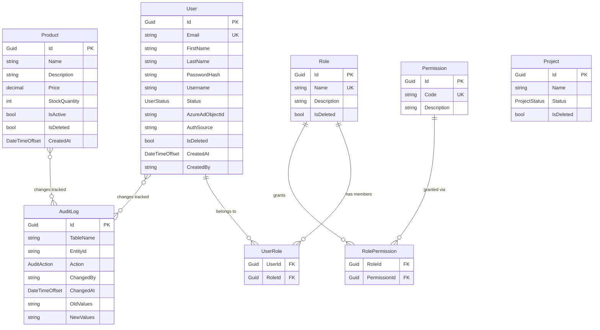

#### Entities

All entities inherit from `BaseEntity` which provides:

| Property | Type | Purpose |
|----------|------|---------|
| `Id` | `Guid` | Immutable primary key (set in constructor) |
| `CreatedAt` | `DateTimeOffset` | UTC timestamp — auto-stamped by Infrastructure |
| `CreatedBy` | `string` | User ID who created — auto-stamped |
| `ModifiedAt` | `DateTimeOffset` | UTC timestamp — auto-updated on save |
| `ModifiedBy` | `string` | User ID who last modified — auto-updated |
| `IsDeleted` | `bool` | Soft-delete flag (private setter — use `Delete()`) |

**Defined Entities:**

| Entity | Description | Key Properties |
|--------|-------------|---------------|
| `User` | System user account | Email, FirstName, LastName, PasswordHash, Status, AzureAdObjectId, AuthSource |
| `Role` | Permission group (Admin, Editor, Viewer) | Name (unique), Description |
| `UserRole` | User↔Role many-to-many junction | UserId, RoleId |
| `Product` | Product catalogue entry | Name, Description, Price (decimal), StockQuantity, IsActive |
| `Project` | Project record | (extensible — add your fields) |
| `Permission` | Fine-grained permission code | Code (e.g. "users.view"), Description |
| `RolePermission` | Role↔Permission many-to-many | RoleId, PermissionId |
| `AuditLog` | Immutable change record | TableName, EntityId, Action, OldValues (JSON), NewValues (JSON) |

**Domain Methods (behaviour on entities):**

```csharp
// User
user.Activate();          // Status → Active
user.Deactivate();        // Status → Inactive
user.Suspend();           // Status → Suspended
user.ProvisionAzureAd(objectId); // Links Azure AD identity
user.UpdateName(first, last);

// Product
product.Update(name, description, price, stock);
product.Deactivate();     // IsActive = false
product.Reactivate();     // IsActive = true

// All entities (via BaseEntity)
entity.Delete();          // IsDeleted = true (soft-delete)
entity.Restore();         // IsDeleted = false
```

#### Enums

| Enum | Values |
|------|--------|
| `UserStatus` | PendingActivation, Active, Inactive, Suspended |
| `ProjectStatus` | (define your own lifecycle states) |
| `AuditAction` | Created, Updated, Deleted, Restored |

#### Domain Exceptions

Each exception maps to a specific HTTP status code via the global middleware:

| Exception | HTTP Status | When to Throw |
|-----------|-------------|---------------|
| `NotFoundException` | 404 | Entity lookup by ID returned null |
| `ConflictException` | 409 | Duplicate email, invalid state transition |
| `ForbiddenException` | 403 | User lacks required permission |
| `UnauthorizedException` | 401 | Missing or invalid credentials |
| `AzureAdTokenValidationException` | 401 | Azure AD token rejected |
| `ExternalApiException` | 502 | Upstream HTTP API call failed |

---

### 4.2 Application Module

**Location:** `src/Application/`
**Dependencies:** Domain, MediatR, FluentValidation, AutoMapper, EF Core (abstractions only)

The Application layer defines *what the system does* — use cases expressed as commands and queries.

#### CQRS Flow Diagram

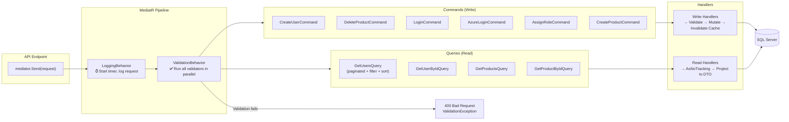

#### CQRS Features

##### Authentication Feature (`Features/Auth/`)

| Handler | Type | Description |
|---------|------|-------------|
| `LoginCommandHandler` | Command | Validates email+password, returns JWT in HttpOnly cookie |
| `AzureLoginCommandHandler` | Command | Validates Azure AD token, creates/links user, returns JWT |

##### Users Feature (`Features/Users/`)

| Handler | Type | Description |
|---------|------|-------------|
| `CreateUserCommandHandler` | Command | Creates user, hashes password, invalidates cache |
| `AssignRoleCommandHandler` | Command | Assigns a role to a user |
| `GetUserByIdQueryHandler` | Query | Returns `UserDto` for a given ID |
| `GetUsersQueryHandler` | Query | Returns `PagedResponse<UserDto>` with filtering & sorting |

##### Products Feature (`Features/Products/`)

| Handler | Type | Description |
|---------|------|-------------|
| `CreateProductCommandHandler` | Command | Creates new product |
| `DeleteProductCommandHandler` | Command | Soft-deletes a product |
| `GetProductByIdQueryHandler` | Query | Returns `ProductDto` for a given ID |
| `GetProductsQueryHandler` | Query | Returns `PagedResponse<ProductDto>` with pagination |

#### MediatR Pipeline Behaviors

Behaviors run automatically for **every** command and query — no per-handler boilerplate:

```
Request → [LoggingBehavior] → [ValidationBehavior] → Handler → Response
```

| Behavior | What It Does |
|----------|-------------|
| `LoggingBehavior` | Logs request name, elapsed time, and any exceptions with a stopwatch |
| `ValidationBehavior` | Runs all FluentValidation validators in parallel; throws `ValidationException` (→ 400) if any fail |

#### Pagination Models

```csharp
// Request — extend this for your queries
public class GetUsersQuery : PagedRequest
{
    public string? SearchTerm { get; set; }
    public string? SortBy { get; set; }
}
// PageNumber defaults to 1, PageSize defaults to 10 (max 100, auto-clamped)

// Response — typed, calculated properties
PagedResponse<UserDto> {
    Items           // IReadOnlyList<T>
    PageNumber      // Current page
    PageSize        // Items per page
    TotalCount      // Total records
    TotalPages      // Calculated: ceil(TotalCount / PageSize)
    HasNextPage     // bool
    HasPreviousPage // bool
}
```

#### Result Pattern

For expected failures (not bugs), use `Result<T>` instead of exceptions:

```csharp
// In a handler
public async Task<Result<UserDto>> Handle(GetUserByIdQuery query, CancellationToken ct)
{
    var user = await _db.Users.FindAsync(query.Id, ct);
    if (user is null)
        return Error.NotFound($"User {query.Id} not found");  // No exception thrown

    return _mapper.Map<UserDto>(user);  // Implicit success
}

// In an endpoint
var result = await _mediator.Send(query, ct);
return result.ToApiResponse();  // Automatically converts Result → IResult (200/404/409 etc.)
```

#### Application Interfaces (Contracts)

The Application layer defines *what it needs* — Infrastructure provides the implementations:

| Interface | Purpose |
|-----------|---------|
| `IApplicationDbContext` | EF Core DbContext abstraction (DbSets + SaveChangesAsync) |
| `ICurrentUserService` | Resolves authenticated user ID and roles from HTTP context |
| `IDateTimeService` | Returns `DateTimeOffset.UtcNow` (mockable for time-travel tests) |
| `IPasswordHasher` | BCrypt hash + verify |
| `ITokenService` | Generate and validate JWT tokens |
| `IAzureAdTokenValidator` | Validate Azure AD ID tokens |
| `ICacheService` | Get/Set/Remove with prefix-based bulk invalidation |
| `IEmailService` | Send emails (SMTP or dev stub) |
| `IFileStorageService` | Upload/Download/Delete/GetUrl |
| `IRepository<T>` | Generic CRUD + AsQueryable for custom queries |
| `IUnitOfWork` | Transaction scope across multiple repositories |
| `IHttpApiClient` | Typed HTTP client for external API calls |

---

### 4.3 Infrastructure Module

**Location:** `src/Infrastructure/`
**Dependencies:** Application, EF Core SQL Server, BCrypt, MSAL, MailKit

Infrastructure implements every interface defined in Application. Swap any implementation without touching Application or Domain.

#### Database (Persistence)

**`ApplicationDbContext`** is the central EF Core context. Its `SaveChangesAsync` override does four things automatically, every time:
1. Stamps `CreatedAt` / `CreatedBy` on new entities
2. Updates `ModifiedAt` / `ModifiedBy` on changed entities
3. Builds `AuditLog` records with JSON snapshots of old and new values
4. Applies soft-delete via the `IsDeleted` global query filter

**Entity Configurations** (`Persistence/Configurations/`):
Each entity has a dedicated `IEntityTypeConfiguration<T>` class — no magic strings, no `[Data Annotations]` in Domain:

```csharp
// UserConfiguration.cs
builder.HasIndex(u => u.Email).IsUnique();
builder.HasQueryFilter(u => !u.IsDeleted);   // Global soft-delete filter
builder.Property(u => u.Email).HasMaxLength(256);
```

**Repository & Unit of Work:**

```csharp
// Inject IUnitOfWork in handlers
public class CreateProductCommandHandler(IUnitOfWork uow)
{
    var product = new Product(...);
    uow.Products.Add(product);
    await uow.SaveChangesAsync(ct);
}
```

#### Identity Services

| Service | Implementation | Notes |
|---------|---------------|-------|
| `CurrentUserService` | Reads JWT claims from `IHttpContextAccessor` | Returns UserId (Guid), Roles |
| `DateTimeService` | Returns `DateTimeOffset.UtcNow` | Mock this in tests for determinism |
| `PasswordHasher` | BCrypt.Net-Next | Work factor configurable |
| `JwtTokenService` | HMAC-SHA256 | Secret key from User Secrets / Key Vault |
| `AzureAdTokenValidator` | Microsoft.IdentityModel | Validates tenant, audience, expiry |

#### Supporting Services

| Service | Description |
|---------|-------------|
| `InMemoryCacheService` | Wraps `IMemoryCache`; supports `RemoveByPrefix("users:")` to invalidate all user cache entries at once |
| `HttpApiClient` | `HttpClientFactory`-managed typed client; attaches `X-Correlation-Id` to all outbound requests |
| `LoggingEmailService` | Dev stub — logs email content to Serilog instead of sending |
| `SmtpEmailService` | Production — sends via MailKit SMTP |
| `LocalFileStorageService` | Stores files on local disk at configured `BasePath` |

#### Configuration Options (Strongly Typed)

All settings use the Options pattern with startup validation — the app refuses to start if configuration is invalid:

| Options Class | Key Settings |
|--------------|-------------|
| `JwtOptions` | SecretKey, Issuer, Audience, ExpiryMinutes |
| `DatabaseOptions` | MaxRetryCount, MaxRetryDelaySeconds |
| `AzureAdOptions` | TenantId, ClientId, SpaClientId |
| `SmtpOptions` | Host, Port, Username, Password, FromAddress |
| `StorageOptions` | BasePath |

---

### 4.4 API Module

**Location:** `src/Api/`
**Dependencies:** Application, Infrastructure, Serilog, Swagger, JWT Bearer

The API layer is thin — it receives HTTP requests, dispatches to MediatR, and converts results to HTTP responses.

#### Endpoints

All endpoints are defined as static methods grouped by resource:

**Auth Endpoints (`/api/v1/`)**

| Method | Route | Description | Auth |
|--------|-------|-------------|------|
| POST | `/login` | Local email+password login | None |
| POST | `/auth/azure-login` | Exchange Azure AD token for JWT | None |
| POST | `/logout` | Clear auth cookie | None |
| POST | `/auth/refresh` | Rotate JWT token | Cookie required |

**User Endpoints (`/api/v1/users`)**

| Method | Route | Description | Permission |
|--------|-------|-------------|-----------|
| GET | `/` | Paginated user list (filter, sort) | CanViewUsers |
| GET | `/{id}` | Get user by ID | CanViewUsers |
| POST | `/` | Create user | CanCreateUser |
| POST | `/{id}/roles` | Assign role to user | CanAssignRoles |

**Product Endpoints (`/api/v1/products`)**

| Method | Route | Description | Permission |
|--------|-------|-------------|-----------|
| GET | `/` | Paginated product list | CanViewProducts |
| GET | `/{id}` | Get product by ID | CanViewProducts |
| POST | `/` | Create product | CanCreateProduct |
| DELETE | `/{id}` | Soft-delete product | CanDeleteProduct |

#### Middleware Pipeline (in order)

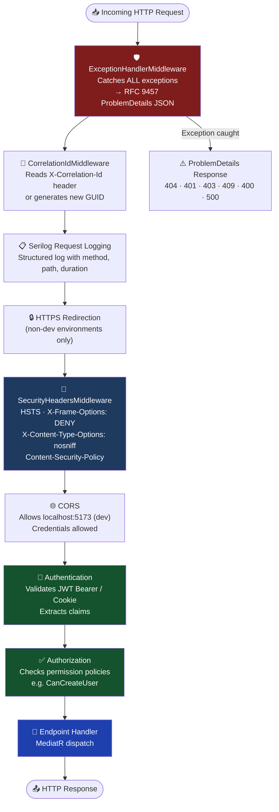

#### Error Response Format (RFC 9457)

Every error returns a consistent JSON structure:

```json
{
  "type": "https://tools.ietf.org/html/rfc9110#section-15.5.5",
  "title": "Not Found",
  "status": 404,
  "detail": "User with ID abc-123 not found",
  "instance": "/api/v1/users/abc-123",
  "traceId": "0HN1GJQFP69G0:00000001",
  "correlationId": "a3f7b2c1-9e4d-4f8a-b2c1-9e4df8ab2c19"
}
```

---

### 4.5 Web (Frontend) Module

**Location:** `src/Web/`

A React 19 + TypeScript SPA using feature-sliced architecture. Communicates with the API exclusively via the Vite proxy (no CORS in development).

#### Feature Modules

**Auth Feature (`src/features/auth/`)**

| File | Purpose |
|------|---------|
| `AzureLoginButton.tsx` | MSAL-powered SSO button with silent sign-in attempt on mount |
| `UserProfileMenu.tsx` | Avatar dropdown with user info and logout |
| `useSilentSso.ts` | Attempts silent Azure AD token acquisition; falls back to redirect |
| `useTokenRefresh.ts` | Polls `/auth/refresh` before JWT expiry |
| `useAzureLogin.ts` | Orchestrates MSAL redirect flow + token exchange |
| `exchangeAzureToken.ts` | POSTs Azure ID token to backend for JWT |
| `msalConfig.ts` | MSAL `PublicClientApplication` setup |

**Users Feature (`src/features/users/`)**

| File | Purpose |
|------|---------|
| `types/index.ts` | `User`, `UserDto`, `UsersResponse` TypeScript interfaces |
| `hooks/useUsers.ts` | `useQuery` → GET /api/v1/users (paginated) |
| `hooks/useUserById.ts` | `useQuery` → GET /api/v1/users/:id |
| `hooks/useCreateUser.ts` | `useMutation` → POST /api/v1/users (invalidates cache on success) |
| `hooks/useAssignRole.ts` | `useMutation` → POST /api/v1/users/:id/roles |
| `components/UsersList.tsx` | Renders grid of user cards |
| `components/CreateUserForm.tsx` | Form with Zod validation |
| `pages/UsersPage.tsx` | Route-level component combining list + form + pagination |

#### State Management Strategy

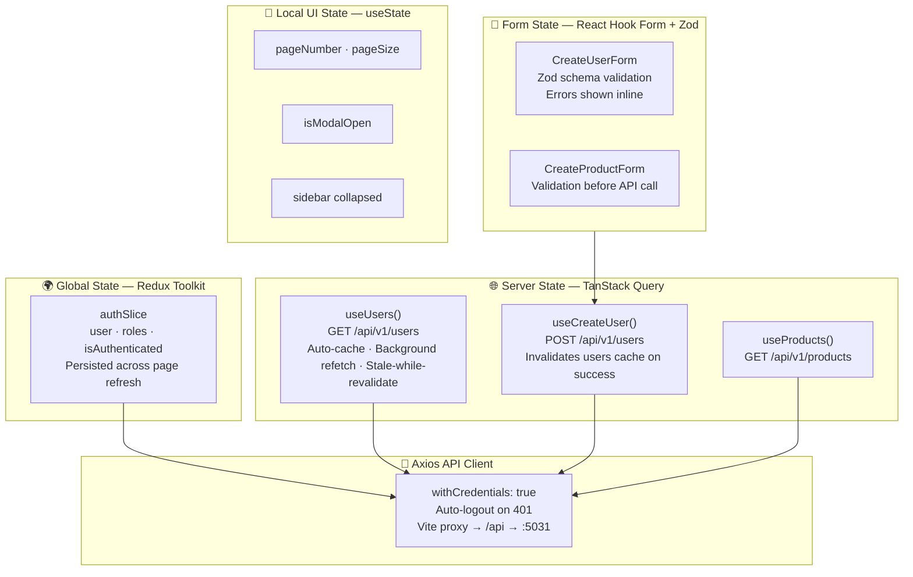

**Rule:** Never put API data (users, products) in Redux. Never put auth state in TanStack Query. Each layer owns exactly one concern.

#### API Communication

```
React Component
  → TanStack Query hook (useUsers)
  → axios apiClient (withCredentials: true)
  → Vite proxy (/api → http://localhost:5031)
  → .NET API
  → MediatR → Handler → EF Core → SQL Server
```

The axios client automatically:
- Sends cookies with every request (`withCredentials: true`)
- Dispatches Redux `logout()` action on any 401 response

#### Vite Proxy Configuration

Configured in `vite.config.ts` — no CORS configuration needed in development:

```typescript
proxy: {
  '/api': {
    target: 'http://localhost:5031',  // .NET API HTTP port
    changeOrigin: true
  }
}
```

---

### 4.6 Tests Module

**Location:** `tests/`

#### Unit Tests (73 tests)

Tests a single class in complete isolation using NSubstitute mocks:

| Test Class | What It Covers |
|-----------|---------------|
| `CreateUserCommandHandlerTests` | Email uniqueness check, password hashing, cache invalidation |
| `CreateUserCommandValidatorTests` | Email format, uniqueness, name length, password complexity rules |
| `AssignRoleCommandHandlerTests` | Role assignment, conflict detection |
| `LoginCommandHandlerTests` | Password verification, JWT generation |
| `AzureLoginCommandHandlerTests` | Azure token exchange, user auto-provisioning |
| `CreateProductCommandHandlerTests` | Product creation, validation |
| `DeleteProductCommandHandlerTests` | Soft-delete flag, 404 on missing ID |
| `InMemoryCacheServiceTests` | Get/Set/Remove, prefix-based bulk invalidation |
| `HttpApiClientTests` | Correlation ID propagation to outbound requests |
| `LocalFileStorageServiceTests` | Upload, download, delete, URL generation |
| `LoggingEmailServiceTests` | Dev email logging (no real SMTP) |

#### Integration Tests (45 tests)

Tests the full HTTP stack using `CustomWebApplicationFactory` with in-memory SQLite:

| Test Class | What It Covers |
|-----------|---------------|
| `UsersEndpointTests` | POST → 201, GET → 200, GET (missing) → 404 |
| `GetUsersFilterSortTests` | Pagination, SearchTerm filtering, SortBy/SortDescending |
| `ProductsEndpointTests` | Full CRUD: POST → 201, GET → 200, DELETE → 204 |
| `AuditCaptureTests` | Verifies AuditLog table captures old/new JSON snapshots |

**Test Infrastructure:**

- `CustomWebApplicationFactory` — Replaces SQL Server with in-memory SQLite, applies migrations, seeds test users/roles
- `TestJwtTokenHelper` — Generates valid JWT tokens with configurable roles/permissions for auth-protected endpoint tests

---

## 5. Features

### Authentication

- **Local Login** — Email + bcrypt password verification → JWT token stored in HttpOnly cookie (not accessible to JavaScript → XSS-safe)
- **Azure AD SSO** — MSAL redirect flow → ID token exchange → backend creates/links user account → JWT in HttpOnly cookie
- **Token Refresh** — Automatic rotation via `/auth/refresh` before expiry
- **Logout** — Clears HttpOnly cookie server-side

### Authorization (Permission-Based RBAC)

Permissions are embedded as claims inside the JWT. Endpoints declare their required permission:

```csharp
app.MapDelete("/api/v1/products/{id}", DeleteProduct)
   .RequireAuthorization("CanDeleteProduct");
```

Seed permissions defined at startup: `users.view`, `users.create`, `products.view`, `products.create`, `products.delete`, `roles.assign`.

### Audit Trail

Every database write is automatically captured — no handler code required:

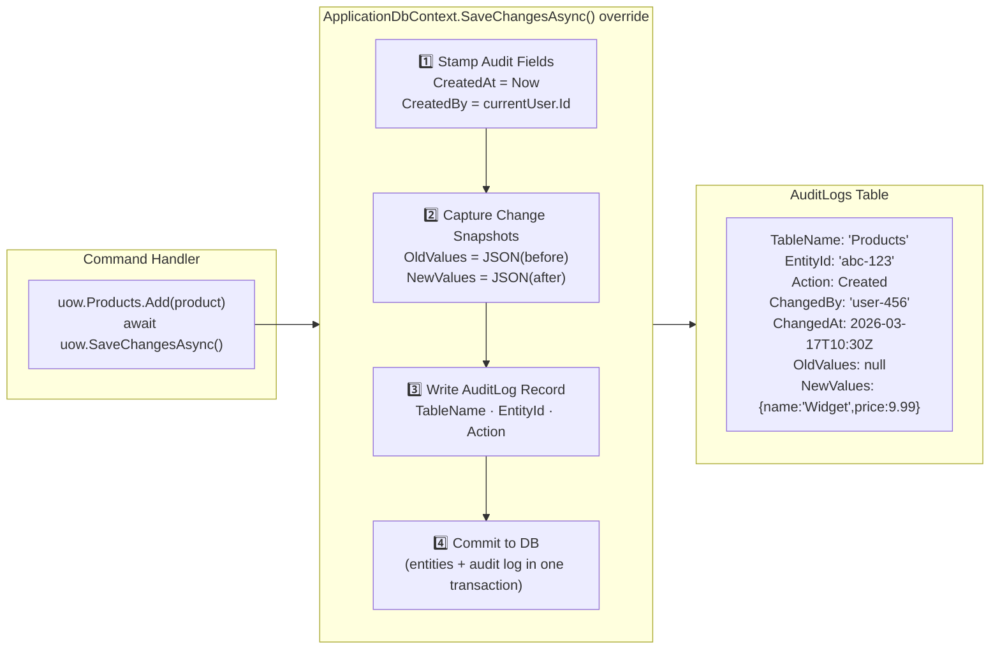

- **Who** — `ChangedBy` (user ID from JWT)
- **When** — `ChangedAt` (UTC timestamp)
- **What** — `Action` (Created / Updated / Deleted / Restored)
- **Before** — `OldValues` (JSON snapshot of previous state)
- **After** — `NewValues` (JSON snapshot of new state)
- **Where** — `TableName` and `EntityId`

### Soft Delete

- Entities are never physically removed from the database
- `entity.Delete()` sets `IsDeleted = true`
- EF Core global query filter automatically excludes deleted records from all queries
- `entity.Restore()` undoes a soft-delete
- Audit log records the `Restored` action

### Pagination

All list endpoints support:

```
GET /api/v1/users?pageNumber=2&pageSize=20&sortBy=email&sortDescending=false&searchTerm=john
```

Response always includes navigation metadata (`hasNextPage`, `hasPreviousPage`, `totalPages`).

### Structured Logging

- Every log entry is structured JSON (fields, not strings)
- `CorrelationId` propagated from the incoming `X-Correlation-Id` header (or auto-generated)
- Same `CorrelationId` attached to all outbound HTTP calls to downstream APIs
- Sensitive fields (passwords, tokens) masked via `[Sensitive]` attribute
- Request duration logged on every HTTP call

### Caching

```csharp
// Cache a result
await _cache.Set("users:123", userDto, TimeSpan.FromMinutes(5));

// Retrieve
var cached = await _cache.Get<UserDto>("users:123");

// Invalidate all user cache entries at once (after create/update)
await _cache.RemoveByPrefix("users:");
```

### Email (Pluggable)

Development: `LoggingEmailService` writes email content to Serilog — no SMTP server needed.
Production: Switch to `SmtpEmailService` by configuring `SmtpOptions` in secrets.

### File Storage (Pluggable)

Development: `LocalFileStorageService` writes to local disk.
Production: Replace with an `AzureBlobStorageService` implementing `IFileStorageService` — no other code changes needed.

---

## 6. Design Patterns

### Clean Architecture

The system is divided into four concentric layers. Inner layers define contracts; outer layers implement them. No outer layer is imported by inner layers.

```
Domain (pure C#)
  ↑ used by
Application (use cases, no framework coupling)
  ↑ used by
Infrastructure (EF Core, Identity, SMTP, etc.)
  ↑ used by
API (HTTP concerns only)
```

### Domain-Driven Design (DDD)

- **Entities** with identity (`Id`) and encapsulated behaviour (`Delete()`, `Activate()`)
- **Value Enums** representing domain concepts (`UserStatus`, `AuditAction`)
- **Ubiquitous Language** — code uses domain terms (soft-delete, audit, provision, assign-role)
- **Domain Exceptions** communicate business rule violations (not HTTP codes)

### CQRS (Command Query Responsibility Segregation)

Every operation is either a **Command** (writes, returns side effects) or a **Query** (reads, no side effects):

```
POST /users → CreateUserCommand → CreateUserCommandHandler
GET  /users → GetUsersQuery    → GetUsersQueryHandler
```

Separation allows independent scaling, caching strategies, and validation rules for reads vs writes.

### Mediator Pattern

MediatR decouples the API from handlers:

```
Endpoint → mediator.Send(command) → Pipeline → Handler
```

The API knows nothing about handler internals. New handlers are discovered automatically via reflection.

### Pipeline Behavior Pattern

Cross-cutting concerns (validation, logging) are applied as MediatR pipeline behaviors — once, globally, without touching individual handlers:

```
Every Request → LoggingBehavior → ValidationBehavior → [Your Handler]
```

### Result Pattern (Discriminated Union)

Replaces exceptions for expected failures:

```csharp
Result<UserDto>   // Either UserDto or an Error (Code + Message + Type)

// Usage
return Error.NotFound("User not found");   // Expected failure
return Error.Conflict("Email taken");      // Expected failure
return userDto;                            // Success (implicit)
```

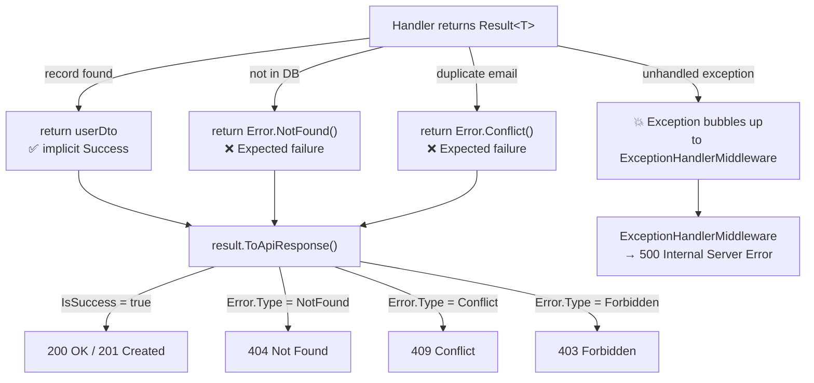

API endpoints convert `Result<T>` to the appropriate HTTP status via `result.ToApiResponse()`.

### Repository Pattern

Abstracts data access behind `IRepository<T>`:

```csharp
IRepository<User>
  Add(entity)
  Update(entity)
  Delete(entity)
  AsQueryable()           // For custom LINQ queries
  SaveChangesAsync()
```

### Unit of Work Pattern

Groups multiple repository operations into a single transaction:

```csharp
IUnitOfWork
  Users       → IRepository<User>
  Roles       → IRepository<Role>
  Products    → IRepository<Product>
  SaveChangesAsync()   // Single commit point
```

### Options Pattern (Strongly Typed Configuration)

All configuration is bound to typed classes with startup validation:

```csharp
services.AddOptions<JwtOptions>()
    .BindConfiguration("Jwt")
    .ValidateDataAnnotations()
    .ValidateOnStart();    // App refuses to start if Jwt:SecretKey is missing
```

### Global Exception Handler

One place handles all exceptions. Domain exceptions map deterministically to HTTP codes. Unknown exceptions become 500 with no stack trace leaked to the client.

### Specification / Query Filter Pattern

EF Core global query filters act as implicit WHERE clauses:

```csharp
// In UserConfiguration.cs — applied to every single query automatically
builder.HasQueryFilter(u => !u.IsDeleted);
```

Developers never accidentally retrieve soft-deleted records.

### Feature-Sliced Architecture (Frontend)

Frontend code is organized by feature, not by technical layer:

```
features/
  users/
    types/       ← domain types
    hooks/       ← data fetching (TanStack Query)
    components/  ← presentational UI
    pages/       ← route-level compositions
    __tests__/   ← co-located tests
```

Delete a feature = delete one folder. No cross-feature dependencies.

---

## 7. API Reference

### Base URL
- Development: `https://localhost:7116/api/v1`
- Swagger UI: `https://localhost:7116/swagger`

### Authentication Header
```http
Authorization: Bearer <jwt-token>
```
Or the token is read automatically from the `auth_token` HttpOnly cookie.

### Common Response Codes

| Code | Meaning |
|------|---------|
| 200 | Success with body |
| 201 | Created — `Location` header points to new resource |
| 204 | Success, no body |
| 400 | Validation failed — body contains field errors |
| 401 | Not authenticated |
| 403 | Authenticated but lacks permission |
| 404 | Resource not found |
| 409 | Conflict (duplicate email, invalid state) |
| 500 | Unhandled server error |

### Pagination Query Parameters

Applies to all `GET /` list endpoints:

| Parameter | Type | Default | Max | Description |
|-----------|------|---------|-----|-------------|
| `pageNumber` | int | 1 | — | Page to return |
| `pageSize` | int | 10 | 100 | Items per page |
| `sortBy` | string | — | — | Property name to sort by |
| `sortDescending` | bool | false | — | Reverse sort order |
| `searchTerm` | string | — | — | Filter by name/email |

---

## 8. Database & Migrations

### Connection

```
Server:   TH-5CD41368G0\SQLEXPRESS  (your local instance)
Database: DotNetStarterKitV2
Auth:     Windows Integrated Security
```

Store the full connection string in User Secrets — never in `appsettings.json`.

### Migration History

| Migration | Date | What Changed |
|-----------|------|-------------|
| `Initial` | 2026-03-09 | User, Role, UserRole, Project tables |
| `AddAzureAdSupport` | 2026-03-10 | AzureAdObjectId, AuthSource on User |
| `DropProductsTable` | 2026-03-13 | Temporary removal |
| `AddPermissionsAndRolePermissions` | 2026-03-14 | Permission + RolePermission tables |
| `SplitFullNameToFirstLastName` | 2026-03-15 | User.FullName → FirstName + LastName |
| `AddUsernameToUsers` | 2026-03-15 | Username column (nullable) |
| `AddAuditLogs` | 2026-03-16 | AuditLog table with JSON columns |
| `AddProducts` | 2026-03-16 | Products table (final schema) |

### Common Migration Commands

```bash
# Create a new migration after changing an entity
dotnet ef migrations add YourMigrationName \
  --project src/Infrastructure \
  --startup-project src/Api

# Apply pending migrations
dotnet ef database update \
  --project src/Infrastructure \
  --startup-project src/Api

# Rollback to a specific migration
dotnet ef database update PreviousMigrationName \
  --project src/Infrastructure \
  --startup-project src/Api
```

### Database Seeding

On every startup, `DataSeeder.SeedAsync()` runs and (if tables are empty) inserts:
- Admin user with hashed password
- Default roles (Administrator, Editor, Viewer)
- Default permissions (users.view, users.create, products.view, etc.)
- Role-permission mappings

---

## 9. Authentication & Authorization

### JWT Flow (Local Login)

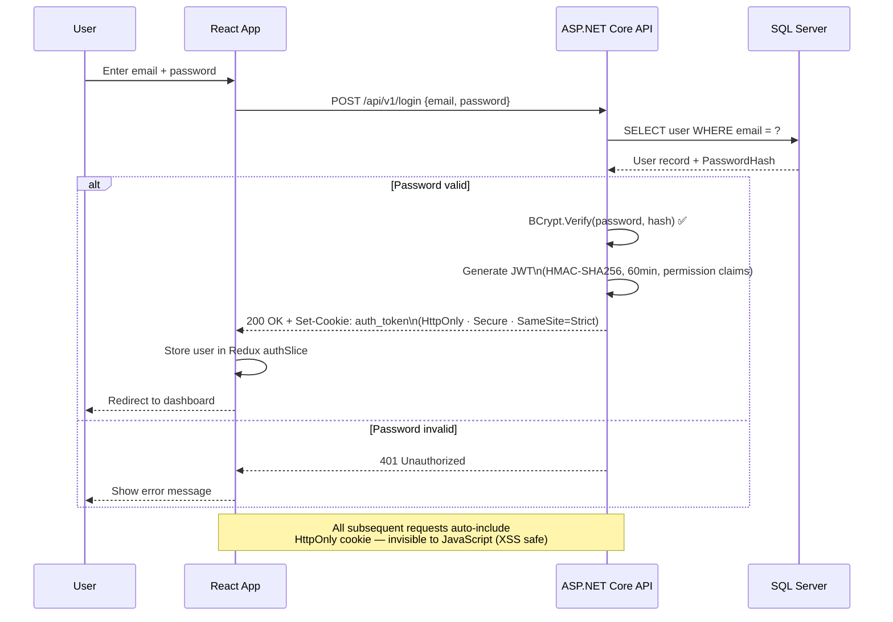

### Azure AD SSO Flow

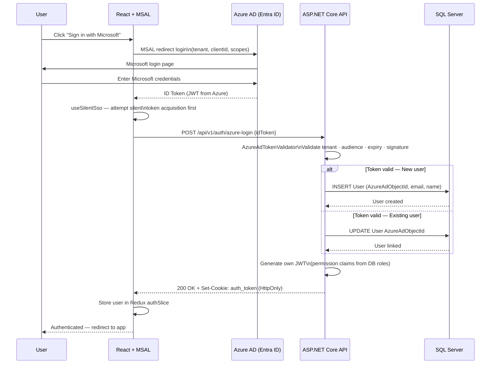

### Adding a New Permission

1. Add permission code to `DataSeeder.cs`
2. Add policy in `ServiceCollectionExtensions.cs`:
   ```csharp
   options.AddPolicy("CanManageInventory", p => p.RequireClaim("permission", "inventory.manage"));
   ```
3. Protect endpoint:
   ```csharp
   app.MapPut("/api/v1/products/{id}/stock", UpdateStock)
      .RequireAuthorization("CanManageInventory");
   ```
4. Assign permission to roles in seeder

---

## 10. Configuration & Secrets

### What Goes Where

| Setting Type | Storage | Example |
|-------------|---------|---------|
| Non-sensitive defaults | `appsettings.json` | Log levels, allowed hosts |
| Environment overrides | `appsettings.{env}.json` | Debug log level in Development |
| Secrets (local dev) | `dotnet user-secrets` | Connection string, JWT key |
| Secrets (production) | Azure Key Vault | All secrets |

**Never commit secrets.** The `.gitignore` excludes `appsettings.Development.json` but still — use User Secrets.

### Setting Up Local Secrets

```bash
dotnet user-secrets init --project src/Api

dotnet user-secrets set "ConnectionStrings:DefaultConnection" \
  "Server=.\SQLEXPRESS;Database=DotNetStarterKitV2;Integrated Security=True;TrustServerCertificate=True" \
  --project src/Api

dotnet user-secrets set "Jwt:SecretKey" "your-minimum-32-char-secret-key-here" \
  --project src/Api

dotnet user-secrets set "Jwt:Issuer" "DotNetStarterKitv2" --project src/Api
dotnet user-secrets set "Jwt:Audience" "DotNetStarterKitv2" --project src/Api
dotnet user-secrets set "Jwt:ExpiryMinutes" "60" --project src/Api
```

---

## 11. Testing Guide

### Running Tests

```bash
# All tests
dotnet test

# With output
dotnet test --verbosity normal

# Specific project
dotnet test tests/Unit
dotnet test tests/Integration

# Frontend tests
cd src/Web && npm run test -- --run
```

### Writing a New Unit Test

Follow the **Arrange / Act / Assert** pattern and name tests descriptively:

```csharp
[Fact]
public async Task Handle_WhenEmailAlreadyExists_ThrowsConflictException()
{
    // Arrange
    var db = Substitute.For<IApplicationDbContext>();
    db.Users.Returns(existingUsers.AsQueryable().BuildMockDbSet());
    var handler = new CreateUserCommandHandler(db, hasher, cache);
    var command = new CreateUserCommand { Email = "existing@test.com" };

    // Act
    Func<Task> act = () => handler.Handle(command, CancellationToken.None);

    // Assert
    await act.Should().ThrowAsync<ConflictException>();
}
```

### Writing a New Integration Test

```csharp
public class MyEndpointTests(CustomWebApplicationFactory factory) : IClassFixture<CustomWebApplicationFactory>
{
    [Fact]
    public async Task PostProduct_WithValidData_Returns201()
    {
        // Arrange
        var client = factory.CreateClient();
        var token = TestJwtTokenHelper.CreateAdminToken();
        client.DefaultRequestHeaders.Authorization = new AuthenticationHeaderValue("Bearer", token);

        // Act
        var response = await client.PostAsJsonAsync("/api/v1/products", new {
            name = "Test Product",
            price = 9.99,
            stockQuantity = 100
        });

        // Assert
        response.StatusCode.Should().Be(HttpStatusCode.Created);
    }
}
```

---

## 12. CI/CD Pipeline

**File:** `.github/workflows/build.yml`
**Triggers:** Push or PR to `main` or `develop`

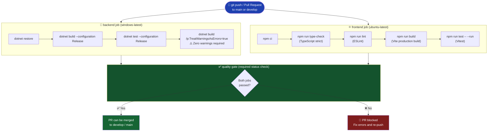

PRs cannot be merged to `main` or `develop` unless the `quality` job passes.

---

## 13. Development Workflow

### Branch Model

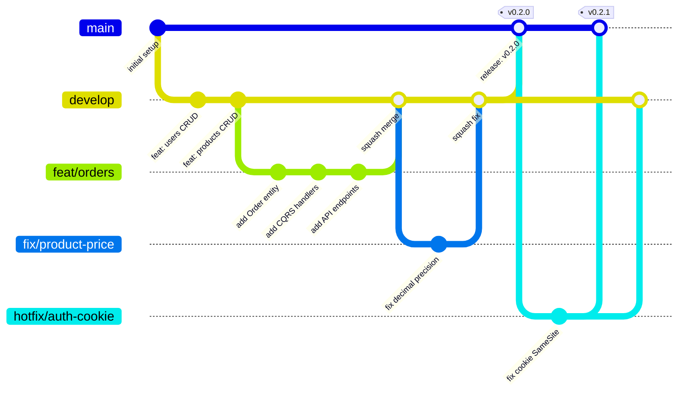

**Rule:** Feature and fix branches always target `develop`. Never `main`.

### Commit Message Style (Conventional Commits)

```
feat(products): add update product endpoint
fix(users): handle null email in search filter
refactor(auth): extract token validation to service
test(products): add integration tests for delete endpoint
docs(readme): update quick start instructions
```

### Pre-Push Checklist (Non-Negotiable)

Before any `git push`, all must pass:

```bash
dotnet test
dotnet clean && dotnet build --configuration Release /p:TreatWarningsAsErrors=true
cd src/Web && npm run type-check && npm run lint && npm run test -- --run
```

Zero errors, zero warnings required. No exceptions.

---

## 14. Extending the Kit

### Adding a New Feature (e.g., "Orders")

Follow this sequence to add a complete new feature:

**1. Domain — Add the entity**
```csharp
// src/Domain/Entities/Order.cs
public class Order : BaseEntity
{
    public Guid UserId { get; private set; }
    public decimal TotalAmount { get; private set; }
    public OrderStatus Status { get; private set; }

    public Order(Guid userId, decimal totalAmount)
    {
        UserId = userId;
        TotalAmount = totalAmount;
        Status = OrderStatus.Pending;
    }
}
```

**2. Infrastructure — Add configuration and migration**
```csharp
// src/Infrastructure/Persistence/Configurations/OrderConfiguration.cs
public class OrderConfiguration : IEntityTypeConfiguration<Order>
{
    public void Configure(EntityTypeBuilder<Order> builder)
    {
        builder.HasQueryFilter(o => !o.IsDeleted);
        builder.Property(o => o.TotalAmount).HasPrecision(18, 2);
    }
}
```
```bash
dotnet ef migrations add AddOrders --project src/Infrastructure --startup-project src/Api
```

**3. Application — Add interfaces and DbSet**
```csharp
// Add to IApplicationDbContext
DbSet<Order> Orders { get; }
```

**4. Application — Add command + validator + handler**
```csharp
// Features/Orders/Commands/CreateOrderCommand.cs
// Features/Orders/Commands/CreateOrderCommandHandler.cs
// Features/Orders/Commands/CreateOrderValidator.cs
// Features/Orders/Dtos/OrderDto.cs
```

**5. API — Add endpoint**
```csharp
// src/Api/Endpoints/Orders/OrdersEndpoints.cs
app.MapPost("/api/v1/orders", CreateOrder)
   .RequireAuthorization("CanCreateOrder");
```

**6. Frontend — Add feature slice**
```
src/features/orders/
  types/index.ts
  hooks/useOrders.ts
  hooks/useCreateOrder.ts
  components/OrdersList.tsx
  pages/OrdersPage.tsx
```

**7. Tests — Add unit and integration tests**
```
tests/Unit/Orders/CreateOrderCommandHandlerTests.cs
tests/Integration/Orders/OrdersEndpointTests.cs
```

### Swapping Infrastructure Implementations

Any `IXxxService` can be replaced with a new implementation:

```csharp
// Replace local file storage with Azure Blob
services.AddScoped<IFileStorageService, AzureBlobStorageService>();
// (instead of LocalFileStorageService)
```

No Application or Domain code changes. Only Infrastructure and DI registration.

---

## Appendix: Port Reference

| Service | Port | Notes |
|---------|------|-------|
| .NET API (HTTPS) | 7116 | `https://localhost:7116` |
| .NET API (HTTP) | 5031 | Used by Vite proxy |
| React Dev Server | 5173 | `http://localhost:5173` |
| SQL Server Express | 1433 | Named instance `\SQLEXPRESS` |

## Appendix: Key Files at a Glance

| File | Purpose |
|------|---------|
| `src/Api/Program.cs` | Application entry point, startup configuration |
| `src/Api/Properties/launchSettings.json` | Visual Studio launch profiles |
| `src/Infrastructure/Persistence/ApplicationDbContext.cs` | EF Core context, audit, soft-delete |
| `src/Application/Common/Behaviors/ValidationBehavior.cs` | Global FluentValidation pipeline |
| `src/Application/Common/Results/Result.cs` | Result pattern implementation |
| `src/Web/vite.config.ts` | Vite dev server + API proxy |
| `src/Web/src/lib/api-client.ts` | Axios HTTP client |
| `tests/Integration/Helpers/CustomWebApplicationFactory.cs` | Integration test host |
| `.github/workflows/build.yml` | CI/CD pipeline |
| `.claude/CLAUDE.md` | AI assistant project instructions |

---

*Generated for DotNetStarterKitv2 — March 2026*
